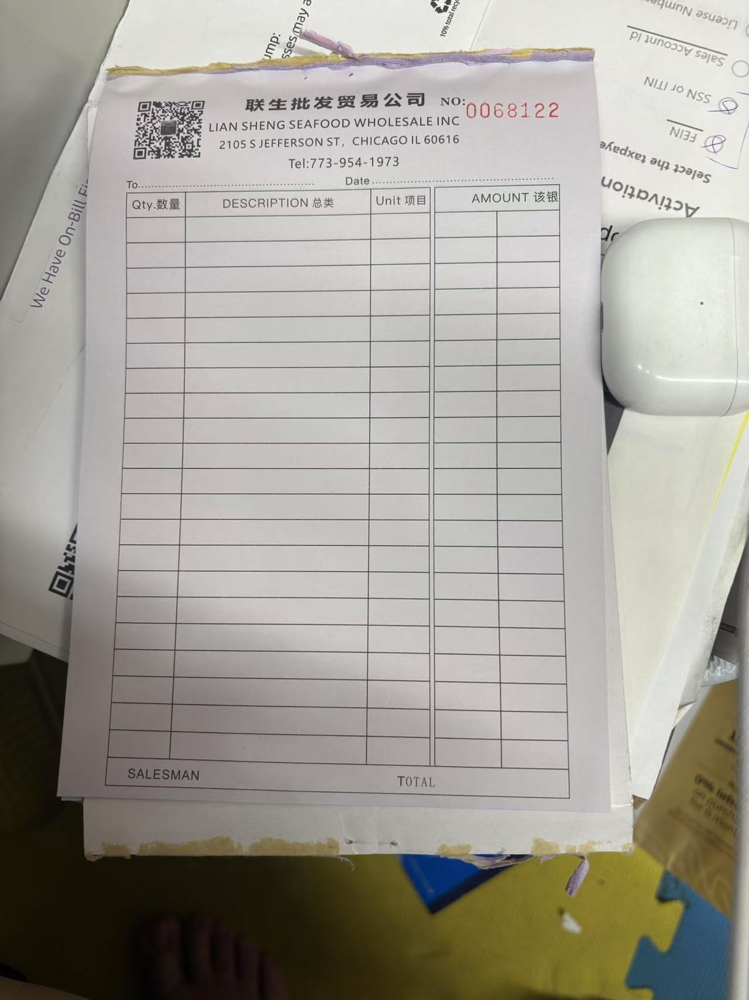
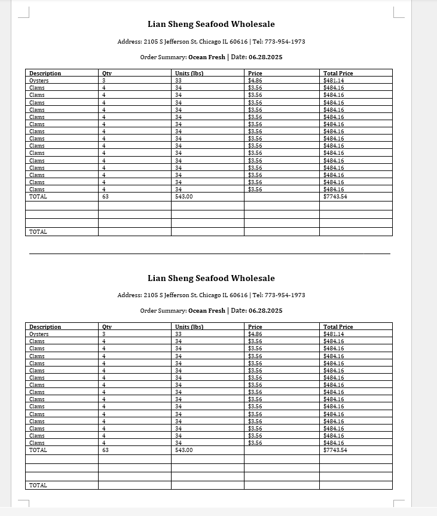
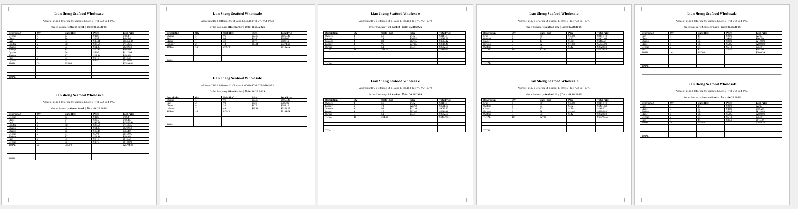

# etl_wholesale_invoice
This project started from a need to automate the creation of invoices for clients. With daily orders and deliveries, small business wholesale owners need to collect daily orders, then manually populate the invoices which could take upwards of an hour or more. Finally deliver the goods to the clients.

This project aims to eliminate that barrier of populating invoices and enable the business owner to drive growth and expand their business. 

The script extracts the data from the orders of the clients and will automatically populate a document file for the wholesaler to print out. Storing a digital copy and a physical copy for the client and business which include the date in the file as well. Additionally, the invoice takes into account for the case when the client wants to order something additional when the seller is there providing fields for the seller to fill in if needed.

This additional document eliminates the need for the invoicer to open multiple files to print out the invoices. 

